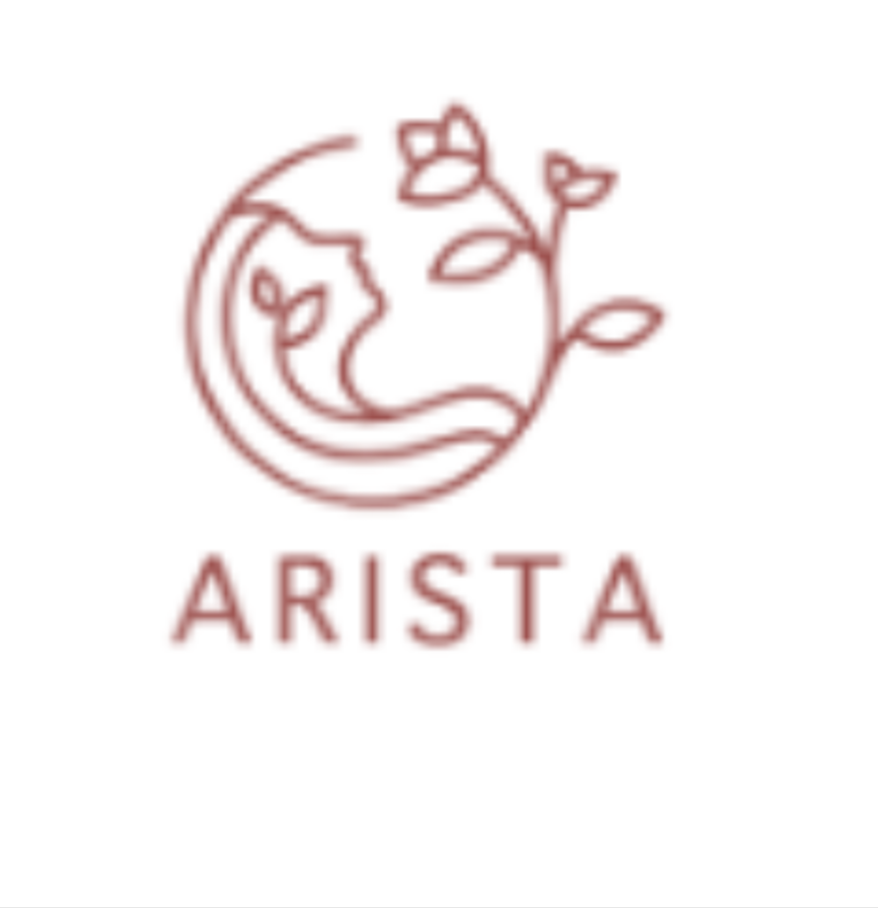
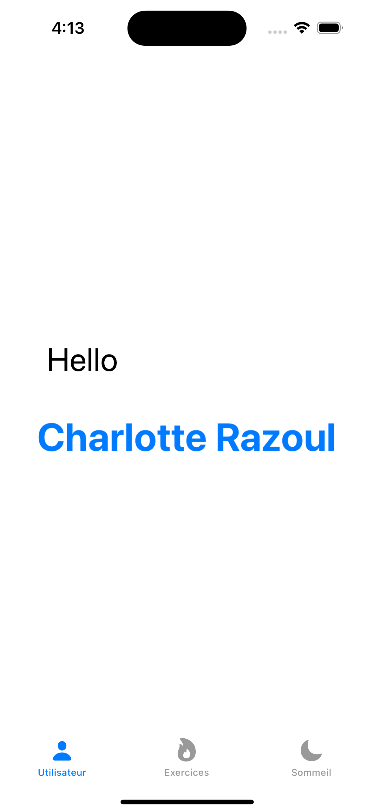
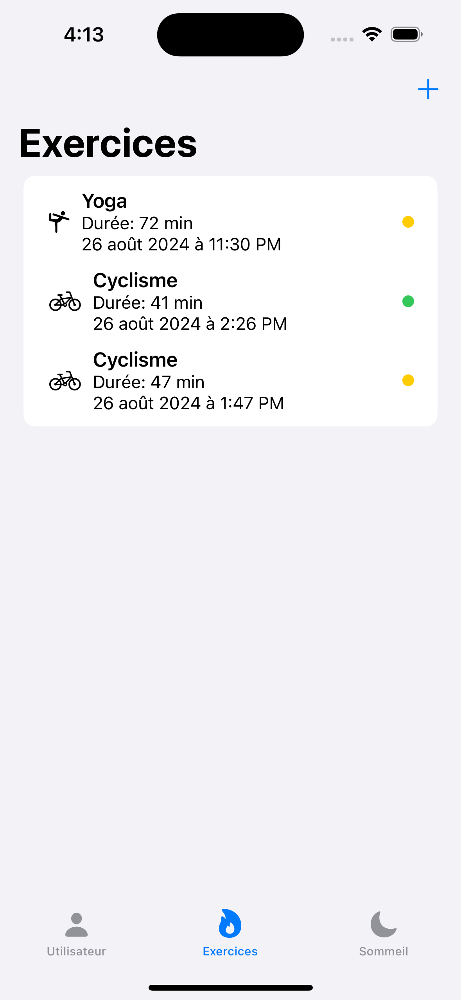
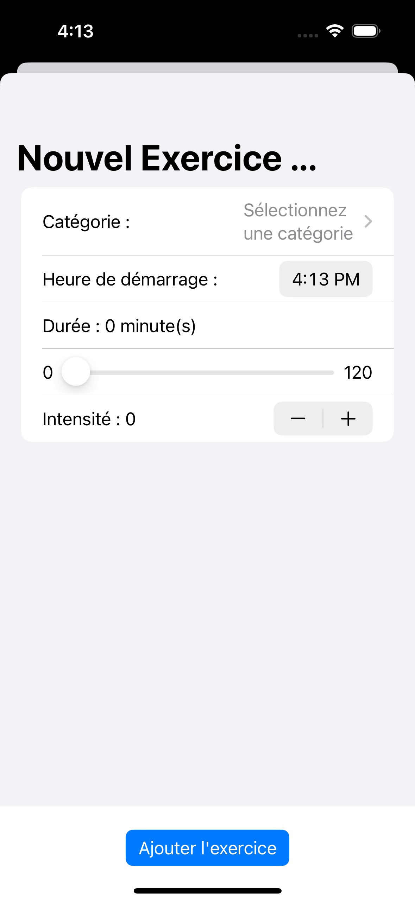
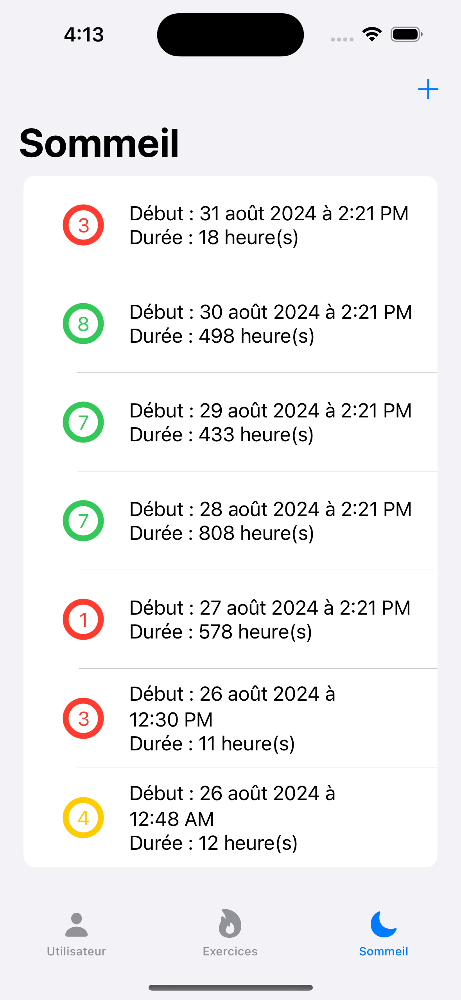
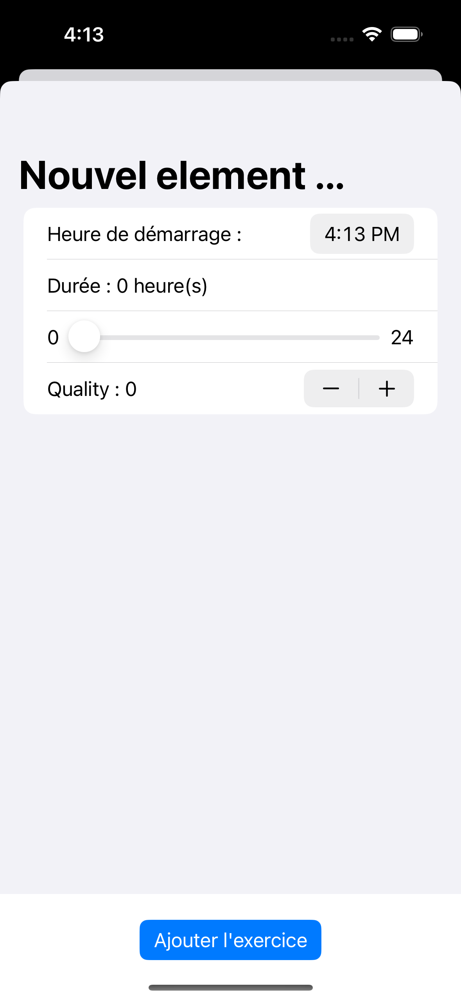

# Health and Well-Being Management Application

This iOS application was developed as part of the "Implement a Database with CoreData" project in the OpenClassrooms training program. It allows users to manage their health and well-being by tracking their exercise sessions and sleep.

## Features

- The application offers the following features:

- Add Exercises: Users can add exercises to their list, specifying the type of exercise, duration, and calories burned.

- Sleep Tracking: Users can record their sleep sessions, specifying the duration and quality of their sleep.

- Statistics Display: The app provides statistics on completed exercises and recorded sleep hours.

- Data Persistence: All data is stored locally using CoreData, ensuring information is retained even if the app is restarted or the device is rotated.

## Technologies Used

- Swift: The programming language used for developing the application.

- CoreData: The built-in iOS framework for managing local databases.

- MVVM: The architecture used to separate responsibilities, making the app modular and maintainable.

## Screenshots

| 

 | 

 | 

 | 

 | 

 |
|:--:|:--:|:--:|:--:|:--:|
| **User** | **Exercises** | **Add an exercise** | **Sleep** | **Add sleep** |

## Demo Video

## Installation

Clone this repository to your machine and open the project in Xcode. Make sure you have the appropriate versions of iOS development tools installed.

## Contributions

Contributions to improving this application are welcome! If you would like to make changes, please open a pull request and describe the proposed modifications.

## License

This project is licensed under the MIT License. For more details, please refer to the LICENSE file.

