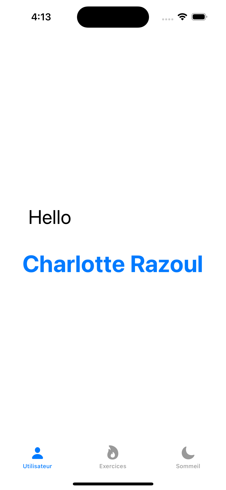
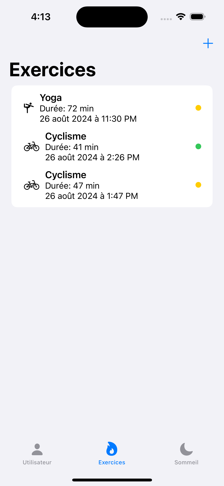
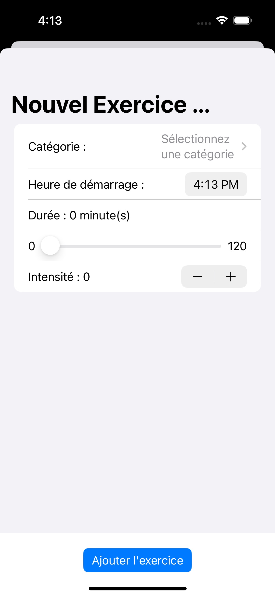
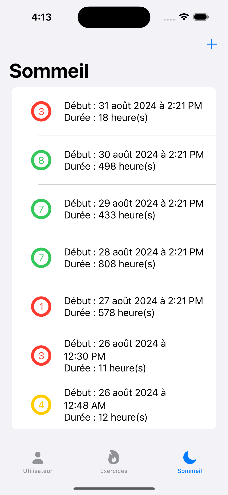
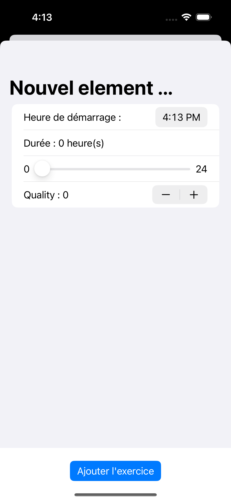

# Application de Gestion de la Santé et du Bien-Être

Cette application iOS a été développée dans le cadre du projet "Mettre en œuvre une base de données avec CoreData" du programme de formation OpenClassrooms. Elle permet aux utilisateurs de gérer leur santé et leur bien-être en suivant leurs séances d’exercice et leur sommeil.

## Fonctionnalités

L’application offre les fonctionnalités suivantes :

- **Ajouter des exercices** : Les utilisateurs peuvent ajouter des exercices à leur liste en précisant le type d’exercice, la durée et les calories brûlées.  
- **Suivi du sommeil** : Les utilisateurs peuvent enregistrer leurs séances de sommeil en précisant la durée et la qualité de leur sommeil.  
- **Affichage des statistiques** : L’application fournit des statistiques sur les exercices réalisés et les heures de sommeil enregistrées.  
- **Persistance des données** : Toutes les données sont stockées localement avec **CoreData**, garantissant que les informations sont conservées même si l’application est redémarrée ou si l’appareil est tourné.  

## Technologies utilisées

- **Swift** : Langage de programmation utilisé pour le développement de l’application.  
- **CoreData** : Framework iOS intégré pour la gestion des bases de données locales.  
- **MVVM** : Architecture utilisée pour séparer les responsabilités, rendant l’application modulaire et maintenable.  

## Captures d’écran

| 

 | 

 | 

 | 

 | 

 |
|:--:|:--:|:--:|:--:|:--:|
| **Utilisateur** | **Exercices** | **Ajouter un exercice** | **Sommeil** | **Ajouter sommeil** |

## Vidéo Démo

## Installation

Clonez ce dépôt sur votre machine et ouvrez le projet dans **Xcode**. Assurez-vous d’avoir installé les versions appropriées des outils de développement iOS.

## Contributions

Les contributions pour améliorer cette application sont les bienvenues ! Si vous souhaitez apporter des modifications, veuillez ouvrir une **pull request** et décrire les changements proposés.

## Licence

Ce projet est sous licence **MIT**. Pour plus de détails, veuillez consulter le fichier LICENSE.
